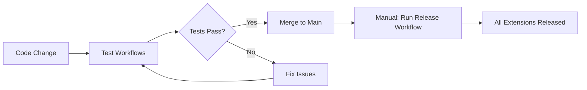

# Extensions Release Guide

## Overview

The `extensions-release.yml` workflow automates releasing **all extensions** in the repository simultaneously. This ensures consistent versioning across the entire extension ecosystem.

## How It Works

### Workflow Trigger

Manual dispatch only (no automatic triggers):
- Navigate to **Actions** → **Extensions Release**
- Click **Run workflow**
- Select release type and options

### What It Does

1. **Discovers all extensions** - Automatically finds all directories with `manifest.json`
2. **Bumps versions** - Updates version in each extension's manifest
3. **Packages extensions** - Creates `.zip` files using realms CLI
4. **Creates tags** - Tags each extension: `{extension-name}-v{version}`
5. **Creates releases** - Individual GitHub releases for each extension
6. **Generates summary** - Pretty table of all released extensions

## Usage

### Basic Release

```bash
# Via GitHub UI
Actions → Extensions Release → Run workflow
  - Release type: patch (1.0.0 → 1.0.1)
  - Create GitHub Release: ✓

# Via GitHub CLI
gh workflow run extensions-release.yml \
  -f release_type=patch \
  -f create_github_release=true
```

### Release Types

| Type | Example | When to Use |
|------|---------|-------------|
| **patch** | 1.0.0 → 1.0.1 | Bug fixes, minor updates |
| **minor** | 1.0.0 → 1.1.0 | New features (backward compatible) |
| **major** | 1.0.0 → 2.0.0 | Breaking changes |

## What Gets Released

### All Extensions

The workflow automatically releases:

- ✅ vault
- ✅ admin_dashboard
- ✅ citizen_dashboard
- ✅ erd_explorer
- ✅ justice_litigation
- ✅ land_registry
- ✅ llm_chat
- ✅ market_place
- ✅ metrics
- ✅ notifications
- ✅ passport_verification
- ✅ public_dashboard
- ✅ test_bench
- ✅ voting
- ✅ welcome

Any directory with a `manifest.json` file is included.

## Output

### Git Tags

Each extension gets its own tag:
```
vault-v1.0.1
admin_dashboard-v1.0.1
citizen_dashboard-v1.0.1
...
```

### GitHub Releases

Each extension gets a separate release:
- **Title:** `{Extension Name} v{version}`
- **Assets:** `{extension}.zip`
- **Installation instructions** in release notes

### Example Release Notes

```markdown
# Admin Dashboard v1.0.1

Comprehensive administrative dashboard for the Generalized Global Governance System

## Installation

realms extension install admin_dashboard --from https://github.com/smart-social-contracts/realms-extensions/releases/download/admin_dashboard-v1.0.1/admin_dashboard.zip

## Changes

This is a patch release of the admin_dashboard extension.

## Commit

abc123...
```

## Workflow Summary

After each run, you'll see a summary table:

| Extension | Version | Download |
|-----------|---------|----------|
| vault | v1.0.1 | [vault.zip](url) |
| admin_dashboard | v1.0.1 | [admin_dashboard.zip](url) |
| ... | ... | ... |

## Version Management

### Semantic Versioning

All extensions follow [SemVer](https://semver.org/):

```
MAJOR.MINOR.PATCH

MAJOR: Breaking changes
MINOR: New features (backward compatible)
PATCH: Bug fixes
```

### Synchronized Versioning

All extensions get the same version bump:
- If you release `patch`, ALL extensions go from 1.0.0 → 1.0.1
- This keeps the ecosystem in sync
- Easier to track "release waves"

### Individual Extension Versions

Each extension maintains its own version in `manifest.json`:
```json
{
  "name": "vault",
  "version": "1.0.1",
  ...
}
```

## Best Practices

### Before Releasing

1. **Test all extensions** - Ensure all tests pass
2. **Review changes** - Check what's being released
3. **Update changelogs** - Document changes in READMEs
4. **Coordinate with team** - Communicate release plans

### Release Frequency

- **Patch releases:** As needed for bug fixes (weekly/bi-weekly)
- **Minor releases:** Feature milestones (monthly)
- **Major releases:** Breaking changes (quarterly/yearly)

### Testing Releases

```bash
# Download and test a release
realms extension install vault --from https://github.com/smart-social-contracts/realms-extensions/releases/download/vault-v1.0.1/vault.zip

# Verify installation
realms extension list
```

## Troubleshooting

### Workflow Failed During Version Bump

**Cause:** Invalid version in manifest.json  
**Fix:**
```bash
# Ensure version is valid semver
jq -r '.version' extension/manifest.json
# Should be: "1.0.0" format
```

### Workflow Failed During Packaging

**Cause:** Extension structure issue  
**Fix:**
```bash
# Validate extension structure
realms extension validate --source-dir ./extension
```

### Release Already Exists

**Cause:** Git tag already exists  
**Fix:**
```bash
# Delete existing tag (if needed)
git tag -d extension-v1.0.1
git push origin :refs/tags/extension-v1.0.1

# Re-run workflow
```

### GitHub Release Creation Failed

**Cause:** GitHub CLI authentication or permissions  
**Fix:** Check repository settings → Actions → General → Workflow permissions

## Advanced Usage

### Dry Run (Testing)

To test without creating releases:
1. Run workflow with `create_github_release: false`
2. Version bumps and tags will still be created
3. No GitHub releases created
4. Manual cleanup if needed:
   ```bash
   git reset --hard HEAD~1
   git push origin --force
   git push origin --delete extension-v1.0.1
   ```

### Selective Extension Release

Currently, the workflow releases all extensions. For selective releases:

**Option 1:** Use individual release workflows (if available)  
**Option 2:** Manually release:
```bash
# Bump version
jq '.version = "1.0.1"' extension/manifest.json > tmp.json
mv tmp.json extension/manifest.json

# Package
realms extension package --extension-id extension --source-dir ./extension

# Create release manually via GitHub UI
```

### Custom Release Notes

Edit the workflow file to customize release notes:
```yaml
cat > release_body.md << EOF
# Custom notes here
...
EOF
```

## Migration from Individual Workflows

If you had extension-specific release workflows (e.g., `vault-release.yml`):

1. **Keep both** - Use individual workflows for hotfixes, unified for major releases
2. **Remove individual workflows** - Rely solely on unified releases
3. **Archive old workflows** - Move to `.github/workflows/archive/`

## Integration with CI/CD

### Automated Release Pipeline



### Release Checklist

- [ ] All extension tests pass
- [ ] Documentation updated
- [ ] Breaking changes documented
- [ ] Team notified
- [ ] Release workflow executed
- [ ] Releases verified
- [ ] Announcement sent

## Related Workflows

- **Test Workflows** - `*-test.yml` - Test individual extensions
- **Vault Release** - `vault-release.yml` - Legacy single-extension release (if kept)

## Resources

- [Semantic Versioning Specification](https://semver.org/)
- [GitHub Releases Documentation](https://docs.github.com/en/repositories/releasing-projects-on-github)
- [Realms CLI Documentation](https://github.com/smart-social-contracts/realms)

## Support

For issues with the release workflow:
1. Check workflow run logs in GitHub Actions
2. Verify extension manifest.json files are valid
3. Ensure realms CLI is compatible
4. Open an issue with error details

---

**Created:** 2025-11-03  
**Version:** 1.0.0  
**Maintainer:** Realms Team
