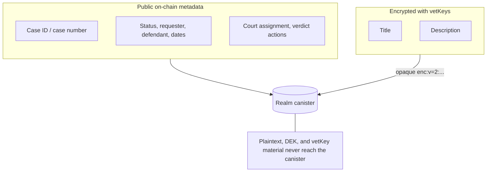
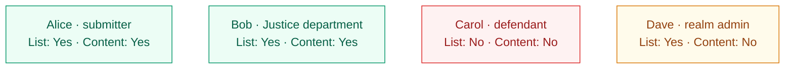
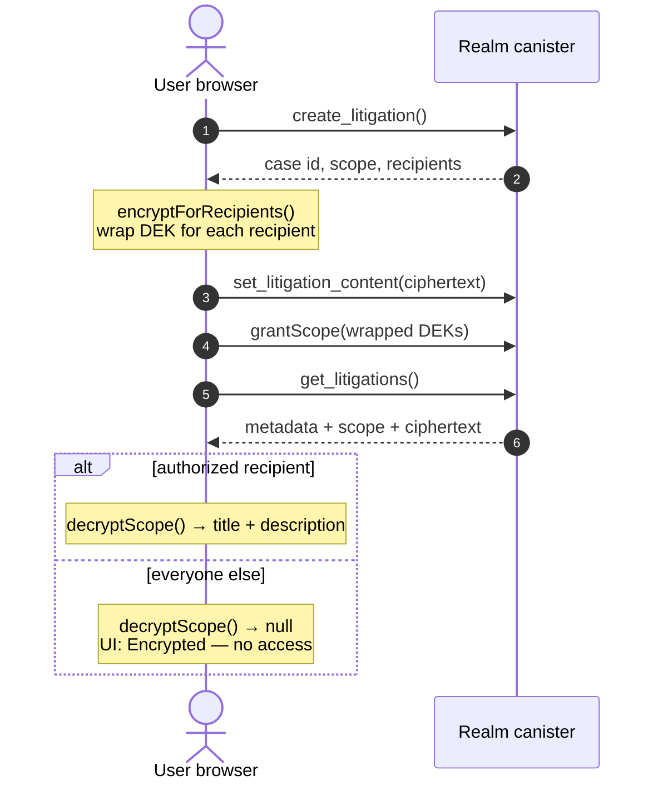

# Justice Litigation

Comprehensive legal case management with courts, judges, verdicts, penalties, and appeals.

## Features

- **Private-by-default litigations** — case titles and descriptions are end-to-end encrypted with [vetKeys](https://internetcomputer.org/docs/current/developer-docs/security/vetkeys) (see below)
- **Justice Systems**: Public and private justice systems
- **Courts**: Multi-level court hierarchy (first instance, appellate, specialized)
- **Judges**: Judge management with specializations and conflict-of-interest checks
- **Cases**: Full case lifecycle from filing to resolution
- **Verdicts**: Formal verdict issuance with reasoning
- **Penalties**: Financial penalties (fines, restitution) with execution tracking
- **Appeals**: Appeals workflow with appellate court review

## Private case content (vetKeys)

Litigation **titles and descriptions** are **private by default**. They are encrypted in the user's browser before anything is stored on the realm, using the host app's vetKeys integration (identity-based encryption on the Internet Computer).

### What is encrypted

| Stored on-chain (visible in lists) | Encrypted (vetKeys) |
|-----------------------------------|---------------------|
| Case ID, case number, status, parties, dates | Title and description |

The canister only ever sees an opaque ciphertext blob (`enc:v=2:…`). It never receives plaintext, the data-encryption key (DEK), or any vetKey material.



### Who can read private content

Decryption keys are granted only to:

1. **The case submitter** (the member who filed the litigation)
2. **Members of the Justice department** (head + members)

The **defendant cannot read** the encrypted title or description — only case metadata visible in the public `Case` record.

If no **Justice** department has been seeded yet, the extension falls back to realm administrators in the `member_data_readers` crypto group so the feature still works out of the box.

> **Note for realm admins:** The admin profile lets you **list all cases** and manage verdicts, but it does **not** automatically grant access to every case's encrypted content. You only decrypt a case if your principal is an authorized recipient for that case's sharing scope (typically because you filed it or you belong to the Justice department).

### Example: who sees what

Consider a realm with these principals:

| Person | Role | Principal (short) |
|--------|------|---------------------|
| Alice | Filed the case | `aaaaa-aa…` |
| Bob | Justice department member | `bbbbb-bb…` |
| Carol | Defendant (user) | `ccccc-cc…` |
| Dave | Realm admin (not in Justice dept) | `ddddd-dd…` |

Alice files a private litigation against Carol titled *"Contract breach over unpaid invoice"*.

| Person | Sees case in list? | Sees title & description? |
|--------|-------------------|---------------------------|
| Alice | Yes (submitter) | Yes — decrypts in browser |
| Bob | Yes (Justice dept) | Yes — decrypts in browser |
| Carol | No (not submitter / justice / admin list view) | No |
| Dave | Yes (admin list view) | **No** — UI shows *"Encrypted — no access"* |

Dave still sees metadata such as case ID `DEMO-2026-0001`, status, requester, defendant, and date — but not the encrypted narrative.



### Sharing scope

Each private case gets a scope string:

```
litigation:<department>:<submitter>:<case_id>
```

**Example:**

```
litigation:Justice:aaaaa-aa:7f3c2b1a-4d5e-6f70-8192-abcdef012345
```

| Part | Meaning |
|------|---------|
| `litigation` | Scope kind registered by this extension |
| `Justice` | Justice department name (configurable via `JUSTICE_DEPARTMENT_NAME`) |
| `aaaaa-aa` | Submitter's principal |
| `7f3c2b1a-…` | Host `Case` id |

**Policy:**

- **Read access:** submitter + Justice department members (via key envelopes)
- **Manage access (grant/revoke wrapped DEKs):** submitter, Justice department head, or realm admin

### How it works (end-to-end)

1. **Open case** — `create_litigation` reserves a case id and returns a sharing `scope` plus `recipients`.
2. **Encrypt locally** — The frontend encrypts title + description with a fresh DEK and IBE-wraps that DEK for each recipient via `ctx.crypto.encryptForRecipients()`.
3. **Store ciphertext** — `set_litigation_content` persists only the ciphertext in the extension's `LitigationContent` entity.
4. **Grant access** — Wrapped DEKs are stored as key envelopes via `ctx.crypto.grantScope()`.
5. **Read** — Authorized users decrypt in the browser with `ctx.crypto.decryptScope()`. Everyone else sees the case in the list but the UI shows **"Encrypted — no access"** for the title/description.



### Example: filing a private litigation (client flow)

**Step 1 — open the case (no plaintext sent to the canister):**

```json
// create_litigation({ "defendant_kind": "user", "defendant_principal": "ccccc-cc…" })
{
  "success": true,
  "data": {
    "id": "7f3c2b1a-4d5e-6f70-8192-abcdef012345",
    "case_number": "DEMO-2026-0042",
    "scope": "litigation:Justice:aaaaa-aa:7f3c2b1a-4d5e-6f70-8192-abcdef012345",
    "recipients": ["bbbbb-bb…", "aaaaa-aa"],
    "message": "Litigation DEMO-2026-0042 opened"
  }
}
```

**Step 2 — encrypt in the browser and attach ciphertext:**

```javascript
const { ciphertext, wrappedDeks } = await ctx.crypto.encryptForRecipients(
  ["bbbbb-bb…", "aaaaa-aa"],  // justice dept + submitter
  {
    title: "Contract breach over unpaid invoice",
    description: "Invoice #8842 was due 2025-11-01; payment never received.",
  },
);

await callExt("set_litigation_content", { id: caseId, ciphertext });
await ctx.crypto.grantScope(scope, wrappedDeks);
```

**Step 3 — list and decrypt on read:**

```json
// get_litigations() returns (private case excerpt)
{
  "id": "7f3c2b1a-4d5e-6f70-8192-abcdef012345",
  "case_number": "DEMO-2026-0042",
  "case_title": "",
  "description": "",
  "is_private": true,
  "content_scope": "litigation:Justice:aaaaa-aa:7f3c2b1a-4d5e-6f70-8192-abcdef012345",
  "content_ciphertext": "enc:v=2:…",
  "requester_principal": "aaaaa-aa",
  "defendant_principal": "ccccc-cc…",
  "status": "filed"
}
```

Authorized client (Alice or Bob):

```javascript
const decrypted = await ctx.crypto.decryptScope(content_scope, content_ciphertext);
// { title: "Contract breach over unpaid invoice", description: "Invoice #8842…" }
```

Unauthorized client (Dave): `decryptScope` returns `null` → UI shows **Encrypted — no access**.

### Example: justice audience lookup

Before encrypting, a client can fetch who receives wrapped DEKs (besides the submitter):

```json
// get_justice_audience()
{
  "success": true,
  "data": {
    "department": "Justice",
    "principals": ["bbbbb-bb…", "eeeee-ee…"]
  }
}
```

### Legacy vs public cases

- **Private cases** — created via `create_litigation` + `set_litigation_content`; title/description live in `LitigationContent` as ciphertext.
- **Legacy plaintext cases** — older demo or migrated rows may still expose `case_title` / `description` directly from the host `Case` entity (`is_private: false`).

## API Entry Points

### New API (v0.2.0+)

| Function | Description |
|----------|-------------|
| `get_justice_systems` | List justice systems |
| `get_courts` | List courts with filtering |
| `get_judges` | List judges with filtering |
| `get_cases` | List cases with filtering |
| `get_case` | Get single case with full details |
| `file_case` | File a new case |
| `assign_judge` | Assign judge to case |
| `get_verdicts` | List verdicts |
| `issue_verdict` | Issue verdict with penalties |
| `get_penalties` | List penalties |
| `execute_penalty` | Execute a penalty |
| `waive_penalty` | Waive a penalty |
| `get_appeals` | List appeals |
| `file_appeal` | File an appeal |
| `decide_appeal` | Decide an appeal |
| `get_statistics` | Get system statistics |

### Court management (v0.4.0+)

| Function | Description |
|----------|-------------|
| `initialize` | Post-install hook: ensures at least one active court exists (safety net) |
| `create_court` | Create a court (realm admins / justice department head only) |
| `seed_default_courts` | One-click fallback court creation when a realm has none (admin-gated; the UI offers this from the Courts tab and the create form's empty state) |

Courts are normally seeded by the realm's codex at init from its
`data/justice.json` template (see `seed_justice_template` in the realm
backend's GGG justice module): quarter-scoped courts are created on every
quarter, capital-scoped appellate/supreme courts only on the capital. The
entry points above exist so realms without a codex template are never left
without a court.

### Legacy litigation API (vetKeys UI)

These entry points power the **Justice & Litigation** sidebar UI and the private-by-default vetKeys flow:

| Function | Description |
|----------|-------------|
| `get_litigations` | List litigations visible to the caller; returns `content_scope` + `content_ciphertext` for client-side decryption |
| `create_litigation` | Open a case (step 1): returns `scope` and `recipients` |
| `set_litigation_content` | Attach encrypted title/description (step 2) |
| `get_justice_audience` | List Justice department principals who receive decryption keys |
| `execute_verdict` | Execute a verdict via Codex code |
| `load_demo_litigations` | Seed demo cases for testing |

New integrations that use courts/judges should prefer `file_case` / `issue_verdict` where possible; attach private content via the same `LitigationContent` + vetKeys pattern when confidentiality is required.

## Data Model

Uses GGG Justice System entities:

- `JusticeSystem` - Public/private justice systems
- `Court` - Courts with jurisdiction and licensing
- `Judge` - Judges with appointments and specializations
- `Case` - Legal cases with parties and status
- `Verdict` - Court decisions with reasoning
- `Penalty` - Financial penalties
- `Appeal` - Appeals to higher courts
- `License` - Court operating licenses

Extension-specific:

- `LitigationContent` - Opaque vetKeys ciphertext + sharing scope for private case narratives

**Category:** Public Services  
**Access:** Members and Admins  
**Version:** 0.3.6
