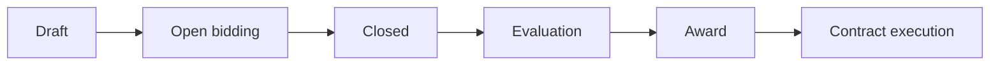
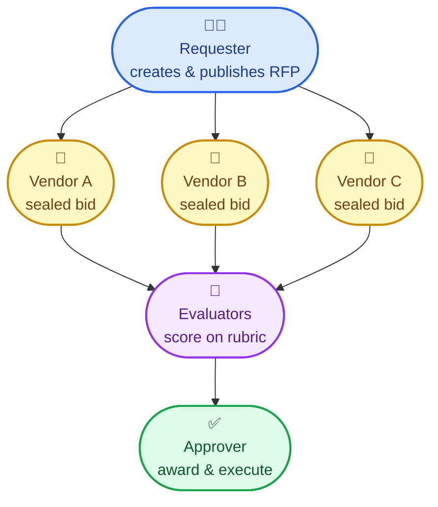
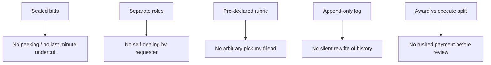
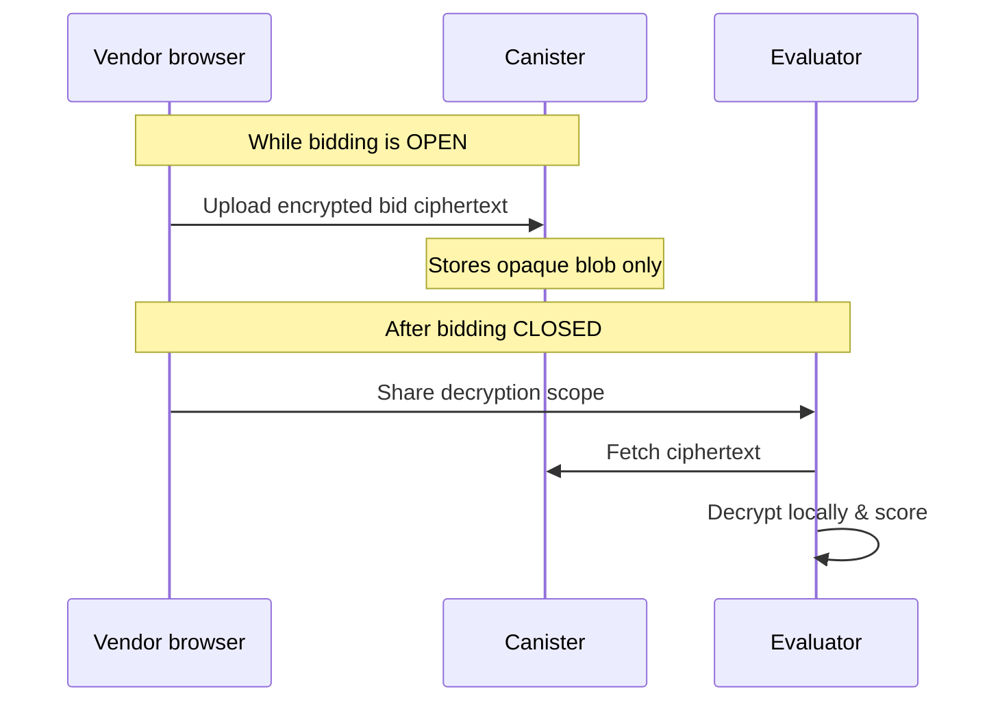

# Procurement extension

Structured public procurement for Realms: RFP lifecycle, bid storage, weighted scoring, and vendor reputation.

## How it works (simple overview)

A department needs to buy something. Instead of an informal “pay vendor X” decision, the realm runs a **Request for Proposal (RFP)** — a fixed pipeline with different people at each step.



| Stage | What happens | Who acts |
|-------|----------------|----------|
| **Draft** | Define need, budget window, scoring rubric | Requester |
| **Open** | Vendors submit **sealed** (encrypted) bids | Vendors |
| **Closed** | Bidding stops; no new bids | System / admin |
| **Evaluation** | Vendors unlock bids; evaluators score against rubric | Evaluators |
| **Award** | Approver picks winner from scored results | Approver |
| **Contract execution** | Contract recorded; work / payment proceeds | Approver |

Every stage change is written to an **append-only audit log** (`RfpTransition`) — who moved the RFP forward, when, and from which state.

### Who does what

Each party is a separate actor — different shape, color, and role. No one box covers the whole process.



| Figurine | Role | Why separate |
|----------|------|----------------|
| 🧑‍💼 **Requester** | Defines the need and opens bidding | Must not pick the winner alone |
| 🏢 **Vendors** | Compete with sealed bids | Must not see each other's offers early |
| 👥 **Evaluators** | Score against a fixed rubric | Must not also be the requester |
| ✅ **Approver** | Awards and records execution | Final check before contract |

No single person creates the need, reads all bids, scores them, and awards the contract to a friend — unless they hold every role (which admins can configure to prevent).

---

## Example: city website redesign

**Need:** Agora’s IT department wants a new public website. Budget cap €50,000. Bidding open for two weeks.

1. **Draft** — IT manager creates an RFP:
   - Title: “Public website redesign”
   - Rubric: Price 40%, Design quality 35%, Delivery timeline 25%
   - Opens Monday, closes Friday 17:00

2. **Open** — Three agencies submit sealed bids:
   - Agency A: €48,000 (encrypted — nobody can read it yet)
   - Agency B: €42,000 (encrypted)
   - Agency C: €51,000 (encrypted — over cap, but still hidden until evaluation)

3. **Closed** — Friday 17:00: bidding ends. No one could see competitors’ prices during the week.

4. **Evaluation** — Each agency clicks **Share with evaluators**. The procurement panel decrypts and scores:

   | Bidder | Price (40) | Design (35) | Timeline (25) | **Total** |
   |--------|------------|-------------|---------------|-----------|
   | Agency B | 38/40 | 30/35 | 22/25 | **90** |
   | Agency A | 35/40 | 32/35 | 20/25 | **87** |
   | Agency C | — | — | — | disqualified (over cap) |

5. **Award** — Approver records Agency B as winner.

6. **Contract execution** — Contract marked active; delivery tracked in the audit log.

---

## Example: office supplies (smaller purchase)

**Need:** Quarterly stationery for 200 staff. Cap $12,000.

1. Requester publishes a one-week RFP with rubric: Price 60%, Delivery speed 40%.
2. Two suppliers bid sealed offers — neither knows the other’s price.
3. After close, evaluators score; Supplier X wins on price and next-day delivery.
4. Approver awards; execution logged.

Same pipeline scales from small purchases to large contracts.

---

## How this prevents corruption

Each safeguard blocks a common abuse pattern:



| Safeguard | Corruption it blocks | Without it |
|-----------|----------------------|------------|
| **Sealed bids (vetKeys)** | Insiders leaking prices; vendors colluding; sniping the lowest bid at the last second | “Tell me your price and I’ll beat it by €1” |
| **Separate roles** | Requester awarding their own vendor | Department head picks cousin’s company and marks own homework |
| **Scoring rubric fixed upfront** | Post-hoc moving goalposts to favor one bidder | “Agency B wins because… vibes” |
| **Append-only audit log** | Denying or rewriting what happened | “That award never existed” after a scandal |
| **Vendor unlock after close** | Evaluators reading bids early | Favoritism before the deadline |
| **Award + execution as two steps** | Paying before anyone checks the decision | Money moves before anyone can object |

This mirrors real **public procurement** law: competition, transparency *after* the deadline, separation of powers, and a paper trail.

---

## Sealed bidding (vetKeys)

Bids are encrypted in the browser with a per-bid DEK wrapped via vetKeys IBE:

1. **Submit:** vendor-only envelope during the open window
2. **After close:** vendor clicks **Share with evaluators** to grant evaluator principals access
3. **Evaluators** decrypt via `ctx.crypto.decryptScope` once shared

The canister stores only opaque `enc:v=2:...` ciphertext.



---

## Roles

Grant extension-local permission strings via `role_manager` / `access_manager` (no realms repo `Operations` change required):

| Permission | Role |
|---|---|
| `procurement.rfp.create` | Requester |
| `procurement.rfp.publish` | Requester |
| `procurement.bid.submit` | Vendor |
| `procurement.evaluate` | Evaluator (or `Procurement` department membership) |
| `procurement.award` | Approver |
| `procurement.execute` | Approver |

Realm admins (`Operations.ALL`) bypass procurement-specific checks.

---

## Lifecycle

```
draft → open → closed → evaluation → award → contract_execution
```

Every transition is logged in `RfpTransition` (append-only).

---

## Backend RPC

Callable via `extension_sync_call('procurement', '<function>', args)`.

See [issue #12](https://github.com/smart-social-contracts/realms-extensions/issues/12) for the full API.

---

## Deploy

```bash
cd extensions/procurement/frontend-rt && npm run build
gh workflow run deploy-files.yml -f scope=extensions-only -f environment=test -f extensions=procurement
```
